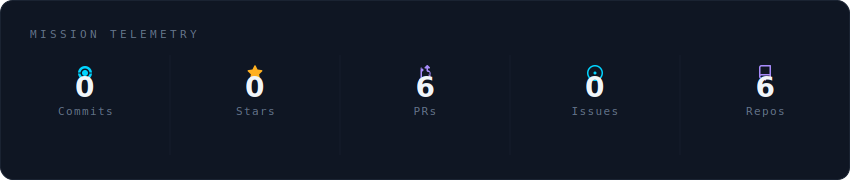
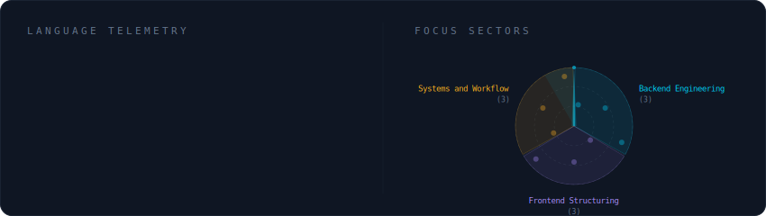

<!-- Galaxy Profile README Template
     Customize this file with your own info, then rename it to README.md
     in your GitHub profile repo (github.com/YOUR_USERNAME/YOUR_USERNAME).
     The SVG paths below point to assets/generated/ which are auto-generated
     by the GitHub Actions workflow or by running: python -m generator.main -->

  

 

  

 

  

 

  

 

## João Henrique Gonçalves

### 🎯 About Me
Full-Stack Developer with strong focus on Backend Engineering and Laravel.  
Passionate about building scalable, secure, and maintainable web applications.

I work with clean architecture principles, automation of processes, and performance-driven systems.  
Focused on real-world problem solving, structured codebases, and continuous technical evolution.

### 💼 What I Do
- Backend development with PHP and Laravel
- Clean architecture and organized project structures
- Process automation and system optimization
- Security best practices and system hardening fundamentals
- Collaborative development using Git-based workflows

### 🚀 Featured Project
**CAMUP System**

Collaborative real-world system where I contribute as a Full-Stack Developer.

**Key Contributions**
- Feature implementation
- Refactoring and performance improvements
- Code review and debugging
- UI structure improvements
- Workflow organization and version control best practices

### 🛠️ Tech Stack
**Languages & Backend**
- PHP (Laravel focus)
- Java
- JavaScript

**Frontend**
- HTML5
- CSS3
- Modern UI structuring

**Tools & Workflow**
- Git / GitHub / GitLab
- VS Code
- Linux
- Docker (learning / usage context)

**Systems & Security**
- Linux environments
- Secure development practices
- Basic networking and infrastructure fundamentals

### 📌 Current Focus
- Improving backend architecture skills
- Writing cleaner and more scalable Laravel applications
- Strengthening system security fundamentals
- Preparing for Junior/Mid Backend opportunities

### 🤝 Open To
- Backend / Full-Stack Developer roles
- Startup collaborations
- Open-source contributions
- Real-world software engineering challenges

### 💭 Dev Mindset
> "I build software not just to work - but to scale, endure, and evolve."
